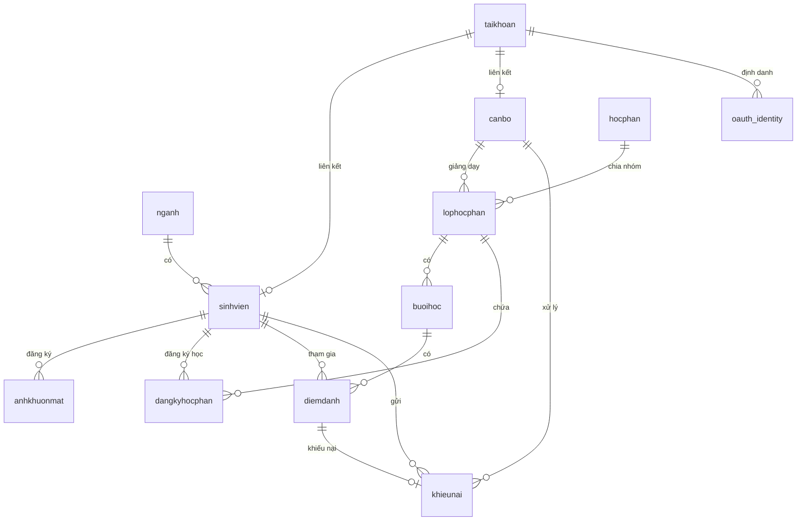

# Thiết kế Cơ sở dữ liệu Hệ thống Điểm danh (Online Attendance Database)

Tài liệu này mô tả chi tiết sơ đồ thiết kế cơ sở dữ liệu quan hệ (PostgreSQL) của hệ thống điểm danh tự động bằng khuôn mặt.

---

## 1. Sơ đồ quan hệ thực thể (Entity-Relationship Diagram)

---

## 2. Chi tiết các bảng dữ liệu

### 2.1. Bảng `taikhoan` (Tài khoản người dùng)
Lưu trữ thông tin xác thực đăng nhập chính của toàn bộ sinh viên, giảng viên và quản trị viên.

| Tên cột | Kiểu dữ liệu | Ràng buộc | Mô tả |
| :--- | :--- | :--- | :--- |
| `ma_tai_khoan` | INTEGER | PK, Serial | Mã tài khoản tự tăng |
| `ten_dang_nhap` | VARCHAR(50) | Unique, Index | Tên tài khoản hoặc email đăng nhập |
| `mat_khau_hash` | VARCHAR(255) | Not Null | Mật khẩu đã mã hóa (argon2/bcrypt) |
| `vai_tro` | VARCHAR(20) | Mặc định: 'SINH_VIEN' | Quyền truy cập (`ADMIN`, `GIANG_VIEN`, `CAN_BO`, `SINH_VIEN`) |
| `trang_thai` | BOOLEAN | Mặc định: True | Trạng thái kích hoạt tài khoản |
| `lan_dang_nhap_cuoi` | TIMESTAMP | Nullable | Thời gian đăng nhập gần nhất |
| `so_lan_dang_nhap_sai`| INTEGER | Mặc định: 0 | Đếm số lần nhập sai mật khẩu liên tiếp |
| `thoi_gian_khoa` | TIMESTAMP | Nullable | Thời gian mở khóa tài khoản (nếu bị khóa tạm thời) |
| `ngay_tao` | TIMESTAMP | Mặc định: NOW() | Ngày tạo tài khoản |

---

### 2.2. Bảng `sinhvien` (Thông tin sinh viên)
Lưu hồ sơ cá nhân và học tập của sinh viên.

| Tên cột | Kiểu dữ liệu | Ràng buộc | Mô tả |
| :--- | :--- | :--- | :--- |
| `ma_sinh_vien` | INTEGER | PK, Serial | Mã số sinh viên tự tăng |
| `ho` | VARCHAR(50) | Not Null | Họ và đệm của sinh viên |
| `ten` | VARCHAR(50) | Not Null | Tên của sinh viên |
| `ngay_sinh` | DATE | Nullable | Ngày sinh sinh viên |
| `gioi_tinh` | VARCHAR(10) | Nullable | Giới tính (`Nam`, `Nữ`, v.v.) |
| `dien_thoai` | VARCHAR(15) | Nullable | Số điện thoại liên lạc |
| `google_email` | VARCHAR(100) | Unique, Nullable | Email Google liên kết OAuth |
| `ma_nganh` | INTEGER | FK -> `nganh.ma_nganh` | Ngành học trực thuộc |
| `ma_tai_khoan` | INTEGER | FK -> `taikhoan.ma_tai_khoan`, Unique | Tài khoản đăng nhập liên kết |
| `trang_thai_hoc` | BOOLEAN | Mặc định: True | Đang học (True) hoặc bảo lưu/đã tốt nghiệp (False) |
| `thoi_gian_bat_dau_hoc`| TIMESTAMP| Mặc định: NOW() | Ngày bắt đầu nhập học |

---

### 2.3. Bảng `canbo` (Thông tin cán bộ / giảng viên)
Lưu hồ sơ giảng dạy và quản lý của giảng viên/nhân viên trường.

| Tên cột | Kiểu dữ liệu | Ràng buộc | Mô tả |
| :--- | :--- | :--- | :--- |
| `ma_can_bo` | INTEGER | PK, Serial | Mã cán bộ tự tăng |
| `ho` | VARCHAR(50) | Not Null | Họ và đệm của cán bộ |
| `ten` | VARCHAR(50) | Not Null | Tên của cán bộ |
| `dien_thoai` | VARCHAR(15) | Nullable | Số điện thoại liên lạc |
| `gioi_tinh` | VARCHAR(10) | Nullable | Giới tính |
| `ngay_sinh` | DATE | Nullable | Ngày sinh |
| `google_email` | VARCHAR(100) | Nullable | Email Google liên kết |
| `ma_tai_khoan` | INTEGER | FK -> `taikhoan.ma_tai_khoan` | Tài khoản đăng nhập liên kết |
| `chuc_vu` | VARCHAR(50) | Nullable | Chức vụ công tác |
| `trang_thai` | BOOLEAN | Mặc định: True | Trạng thái công tác |

---

### 2.4. Bảng `anhkhuonmat` (Đặc trưng sinh trắc học khuôn mặt)
Lưu giữ thông tin ảnh khuôn mặt của sinh viên phục vụ AI Face Recognition.

| Tên cột | Kiểu dữ liệu | Ràng buộc | Mô tả |
| :--- | :--- | :--- | :--- |
| `ma_anh` | INTEGER | PK, Serial | Mã ảnh tự tăng |
| `ma_sinh_vien` | INTEGER | FK -> `sinhvien.ma_sinh_vien` | Sinh viên sở hữu khuôn mặt |
| `duong_dan_anh` | VARCHAR(255) | Not Null | Đường dẫn lưu trữ file ảnh vật lý trên server |
| `loai_anh` | VARCHAR(20) | Mặc định: 'DANG_KY' | Thể loại ảnh (`DANG_KY` - ảnh gốc, hoặc ảnh điểm danh) |
| `embedding_vector` | FLOAT[] | Not Null | Mảng float chứa vector đặc trưng (128 hoặc 512 chiều) |
| `ngay_tao` | TIMESTAMP | Mặc định: NOW() | Ngày chụp/đăng ký ảnh |

---

### 2.5. Bảng `hocphan` (Danh mục học phần / môn học)
Lưu thông tin danh mục môn học đào tạo trong trường học.

| Tên cột | Kiểu dữ liệu | Ràng buộc | Mô tả |
| :--- | :--- | :--- | :--- |
| `ma_hoc_phan` | INTEGER | PK | Mã học phần (nhập thủ công) |
| `ten_hoc_phan` | VARCHAR(100) | Not Null | Tên môn học |
| `mo_ta` | TEXT | Nullable | Mô tả chi tiết môn học |
| `so_tin_chi` | INTEGER | Not Null | Số tín chỉ của học phần |
| `trang_thai` | BOOLEAN | Mặc định: True | Trạng thái áp dụng môn học |

---

### 2.6. Bảng `lophocphan` (Lớp học phần)
Nhóm học phần giảng dạy trong học kỳ cụ thể do giảng viên quản lý.

| Tên cột | Kiểu dữ liệu | Ràng buộc | Mô tả |
| :--- | :--- | :--- | :--- |
| `ma_lop_hoc_phan` | INTEGER | PK, Serial | Mã lớp tự tăng |
| `ma_hoc_phan` | INTEGER | FK -> `hocphan.ma_hoc_phan` | Thuộc môn học nào |
| `ma_can_bo` | INTEGER | FK -> `canbo.ma_can_bo` | Giảng viên phụ trách giảng dạy |
| `hoc_ky` | INTEGER | Not Null | Học kỳ (1, 2, 3) |
| `nam_hoc` | VARCHAR(20) | Not Null | Năm học giảng dạy (ví dụ: `2025-2026`) |
| `ty_le_chuyen_can_toi_thieu`| NUMERIC | Mặc định: 0.8 | Tỷ lệ đi học tối thiểu để được thi cuối kỳ |
| `trang_thai` | BOOLEAN | Mặc định: True | Trạng thái hoạt động của lớp |
| `ngay_tao` | TIMESTAMP | Mặc định: NOW() | Ngày mở lớp |

---

### 2.7. Bảng `buoihoc` (Buổi học cụ thể)
Chi tiết từng buổi lên lớp của một lớp học phần.

| Tên cột | Kiểu dữ liệu | Ràng buộc | Mô tả |
| :--- | :--- | :--- | :--- |
| `ma_buoi_hoc` | INTEGER | PK, Serial | Mã buổi học tự tăng |
| `ma_lop_hoc_phan` | INTEGER | FK -> `lophocphan.ma_lop_hoc_phan` | Thuộc lớp học phần nào |
| `ngay_hoc` | DATE | Not Null | Ngày diễn ra buổi học |
| `gio_bat_dau` | TIME | Not Null | Giờ bắt đầu học |
| `gio_ket_thuc` | TIME | Not Null | Giờ kết thúc buổi học |
| `so_buoi` | INTEGER | Not Null | Số thứ tự buổi học (buổi số 1, số 2...) |
| `trang_thai` | VARCHAR(20) | Not Null | Trạng thái (`CHUA_DIEM_DANH`, `DANG_DIEM_DANH`, `DA_KET_THUC`) |
| `nguong_nhan_dien` | FLOAT | Mặc định: 0.5 | Độ tương đồng tối thiểu để AI chấp nhận khuôn mặt |
| `so_phut_muon_toi_da` | INTEGER | Mặc định: 15 | Số phút trễ cho phép trước khi bị đánh dấu đi muộn |
| `ghi_chu` | TEXT | Nullable | Ghi chú buổi học |

---

### 2.8. Bảng `diemdanh` (Lịch sử điểm danh)
Lưu kết quả điểm danh của sinh viên trong mỗi buổi học.

| Tên cột | Kiểu dữ liệu | Ràng buộc | Mô tả |
| :--- | :--- | :--- | :--- |
| `ma_diem_danh` | INTEGER | PK, Serial | Mã điểm danh tự tăng |
| `ma_sinh_vien` | INTEGER | FK -> `sinhvien.ma_sinh_vien` | Sinh viên được điểm danh |
| `ma_buoi_hoc` | INTEGER | FK -> `buoihoc.ma_buoi_hoc` | Điểm danh cho buổi học nào |
| `trang_thai` | VARCHAR(20) | Not Null | Kết quả (`CO_MAT`, `DI_MUON`, `VANG`) |
| `phuong_thuc` | VARCHAR(20) | Not Null | Hình thức (`KHUON_MAT` - nhận diện camera, `THU_CONG` - giảng viên tích) |
| `do_tin_cay` | FLOAT | Nullable | Độ tin cậy (%) phản hồi từ mô hình AI |
| `thoi_diem_diem_danh` | TIMESTAMP | Mặc định: NOW() | Thời gian thực hiện điểm danh thành công |

---

### 2.9. Bảng `khieunai` (Khiếu nại điểm danh)
Sinh viên khiếu nại kết quả điểm danh khi có sự cố hệ thống.

| Tên cột | Kiểu dữ liệu | Ràng buộc | Mô tả |
| :--- | :--- | :--- | :--- |
| `ma_khieu_nai` | INTEGER | PK, Serial | Mã khiếu nại tự tăng |
| `ma_diem_danh` | INTEGER | FK -> `diemdanh.ma_diem_danh` | Liên kết đến bản ghi điểm danh bị khiếu nại |
| `ma_sinh_vien` | INTEGER | FK -> `sinhvien.ma_sinh_vien` | Sinh viên gửi đơn khiếu nại |
| `ly_do` | TEXT | Not Null | Lý do giải trình của sinh viên |
| `trang_thai` | VARCHAR(20) | Mặc định: 'CHO_XU_LY' | Trạng thái xử lý (`CHO_XU_LY`, `DA_DUYET`, `TU_CHOI`) |
| `ngay_gui` | TIMESTAMP | Mặc định: NOW() | Thời gian gửi đơn |
| `ma_can_bo_xu_ly` | INTEGER | FK -> `canbo.ma_can_bo` | Giảng viên phụ trách xem xét đơn |
| `ghi_chu_xu_ly` | TEXT | Nullable | Ý kiến phản hồi từ người duyệt đơn |
| `ngay_xu_ly` | TIMESTAMP | Nullable | Thời gian duyệt hoặc từ chối đơn |

---

### 2.10. Bảng `oauth_identity` (Thông tin liên kết Google OAuth)
Liên kết các tài khoản đăng nhập với thông tin định danh của nhà cung cấp bên thứ 3 (Google).

| Tên cột | Kiểu dữ liệu | Ràng buộc | Mô tả |
| :--- | :--- | :--- | :--- |
| `ma_oauth_identity` | INTEGER | PK, Serial | Mã ID tự tăng |
| `provider` | VARCHAR | Not Null | Tên nhà cung cấp (mặc định: `'google'`) |
| `provider_subject` | VARCHAR | Not Null | Google Subject ID duy nhất |
| `email` | VARCHAR | Not Null | Địa chỉ Gmail của tài khoản Google liên kết |
| `ma_tai_khoan` | INTEGER | FK -> `taikhoan.ma_tai_khoan` | Tài khoản liên kết trong hệ thống |
| `ngay_tao` | TIMESTAMP | Mặc định: NOW() | Ngày tạo liên kết |
| `ngay_cap_nhat` | TIMESTAMP | Mặc định: NOW() | Ngày cập nhật trạng thái |
| `lan_dang_nhap_cuoi` | TIMESTAMP | Nullable | Lần sử dụng đăng nhập gần nhất |
